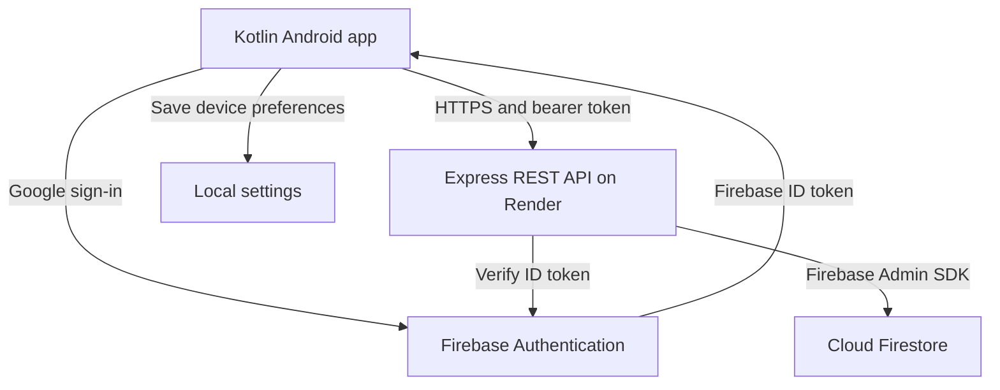

# StudySync

StudySync is a native Kotlin Android study planner for **PROG7314 POE Part 2**. Students sign in with Google, organise subjects, manage study tasks and track completion. A custom REST API hosted on Render stores each user's subjects and tasks in Cloud Firestore.

## Project links

GitHub Repository 		           ->	https://github.com/ST10435330/PROG7314_POE_Part_2

GitHub build and test workflows    ->	https://github.com/ST10435330/PROG7314_POE_Part_2/actions

Hosted API Health check	           ->	https://prog7314-poe-part-2.onrender.com/api/health

YouTube demonstration 	           ->	https://youtu.be/d-Y73tCCgLY

API Video Demonstration	           ->	https://youtu.be/jVKDiaOgvVY


## Group contributions

| Member | Contribution |
| --- | --- |
| Antonio Bechev — ST10435330 | Android application, interface, app features and integration with Firebase Authentication and the hosted API. |
| [GROUP MEMBER NAME AND STUDENT NUMBER] | Created the custom REST API and Cloud Firestore database. |

## Features and rubric coverage

| Part 2 criterion | Marks | StudySync implementation or required evidence |
| --- | ---: | --- |
| Runs on a mobile device | 5 | Native Android app; demonstrate the latest build running on a physical phone. |
| SSO sign-in | 10 | Google sign-in through Firebase Authentication; first sign-in creates the account, with returning login and sign-out. |
| Settings menu | 10 | Default task priority and sorting preference, saved on the device and used by the task screen. |
| REST API creation | 10 | Express API with Firebase token verification, validation and Firestore persistence. |
| REST API integration | 10 | Retrofit and OkHttp send authenticated requests to create, load, update and delete subjects and tasks. |
| User-defined feature 1 | 10 | Subject and task management, including editing, deletion and assigning tasks to subjects. |
| User-defined feature 2 | 10 | Due dates, priorities, overdue labels, filtering by subject/status and sorting by date, priority or title. |
| User-defined feature 3 | 10 | Complete or reopen tasks, with overall and per-subject completion progress. |
| User interface | 10 | Compose Material 3 screens, consistent navigation, input validation, loading indicators and error/retry feedback. |
| GitHub, README and automated testing | 10 | Source history, this README, Android JUnit tests and Node tests run through GitHub Actions. |
| Demonstration video | 5 | Narrated physical-phone demonstration linked above; include authentication and cloud data verification. |
| **Total** | **100** | Coverage describes the prototype; marks depend on implementation quality and submitted evidence. |

## Architecture and design



Compose screens handle interaction. `StudyRepository` defines data operations, and `ApiStudyRepository` implements them through Retrofit. The API verifies the user's Firebase ID token, derives the user ID from that token, validates inputs and reads or writes only that user's records. Subjects and tasks are not written directly to Firestore by Android.

The API checks duplicate subject names and prevents deleting a subject that still has tasks. Transactions coordinate these checks with database updates. Android handles filtering, sorting and progress calculations. Settings are device preferences and are not synchronised through the API. Android logging records lifecycle and operation events without deliberately logging authentication tokens.

## API and data

Base URL: `https://prog7314-poe-part-2.onrender.com/api/`

| Method | Endpoint | Purpose |
| --- | --- | --- |
| GET | `health` | Public service health response. |
| GET / POST | `subjects` | List or create the signed-in user's subjects. |
| PATCH / DELETE | `subjects/{id}` | Update or delete a subject. |
| GET / POST | `tasks` | List or create the signed-in user's tasks. |
| PATCH / DELETE | `tasks/{id}` | Update or delete a task. |

Every data endpoint requires `Authorization: Bearer <Firebase ID token>`. The root URL is not a webpage; use `/api/health` for the public health check.

- Subjects: `subjectId`, `name`, `lecturerName` (strings).
- Tasks: `taskId`, `subjectId`, `title`, `description`, `dueDate`, `priority` (strings), and `completed` (boolean).
- Dates use `YYYY-MM-DD`; priorities are `HIGH`, `MEDIUM` or `LOW`.
- Record IDs are generated by the backend and included in responses; do not include record IDs in create request bodies.
- Firestore paths: `users/{uid}/subjects/{subjectId}` and `users/{uid}/tasks/{taskId}`. The API also maintains an internal subject name key and a user write revision.

## Run the Android app

Requirements: Android Studio, JDK 17, Android SDK 35 and an Android device running Android 8.0/API 26 or later with Google sign-in available.

```powershell
git clone https://github.com/ST10435330/PROG7314_POE_Part_2.git
cd PROG7314_POE_Part_2
powershell -NoProfile -ExecutionPolicy Bypass -File .\scripts\bootstrap-gradle.ps1
```

1. Open the project folder in Android Studio and allow Gradle to sync.
2. Register `com.studysync.app` in the Firebase project and enable Google sign-in.
3. Run `.\gradlew.bat signingReport` and register the debug signing fingerprints in Firebase.
4. Download the updated Firebase configuration to `app/google-services.json`.
5. Confirm the base URL in `StudyApi.kt`, connect the phone with USB debugging enabled and press **Run**.

Keep Firebase service-account credentials out of the repository and Android app.

## Run the backend locally

Use Node.js 24. From the project root:

```powershell
cd server
npm ci
Copy-Item .env.example .env
```

Configure `GOOGLE_APPLICATION_CREDENTIALS` in `.env` to point to an authorised Firebase service-account JSON file, and set `PORT=3000`. Enable Cloud Firestore in the same Firebase project as Authentication. Run `npm start` and open `http://localhost:3000/api/health`.

The deployed Render service uses root directory `server`, build command `npm ci` and start command `npm start`. Supply backend credentials through its secret configuration. Direct Firestore client access should be denied; the API accesses Firestore through Firebase Admin credentials.

## Tests and GitHub Actions

From the project root:

```powershell
.\gradlew.bat :app:assembleDebug :app:testDebugUnitTest
Push-Location server
npm ci
npm test
Pop-Location
```

The current source contains 23 Android unit tests for validation and task logic, and 12 backend tests for validation, authentication requirements and user-scoped record paths. Backend tests use test doubles and do not replace live Firebase and physical-device testing.

- `android.yml` builds the debug app, runs JUnit tests and uploads test reports. Add the Firebase Android configuration as the repository secret `GOOGLE_SERVICES_JSON`.
- `backend.yml` installs locked dependencies and runs the Node test suite.
- Both workflows run on pushes and pull requests, and support manual runs. Check the latest commit's actual results through the Actions link above.


## Technical references

- [Firebase Google sign-in for Android](https://firebase.google.com/docs/auth/android/google-signin)
- [Firebase Admin ID token verification](https://firebase.google.com/docs/auth/admin/verify-id-tokens)
- [GitHub Actions documentation](https://docs.github.com/en/actions/get-started/understand-github-actions)
- [Deploying Express on Render](https://render.com/docs/deploy-node-express-app)
